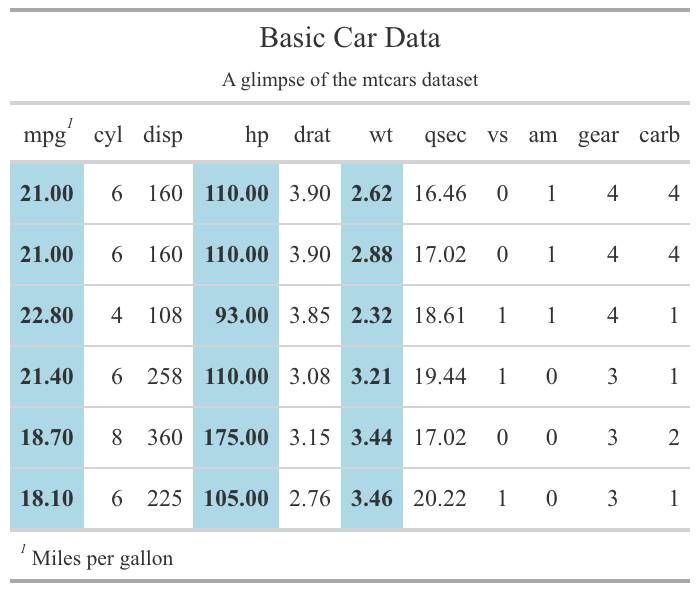

```{r setup, include=FALSE}
knitr::opts_chunk$set(echo = TRUE)
library(gt)
```
<!-- Add CSS in a style block -->
<style>
.two-columns {
  display: flex;
}
.column {
  flex: 1;
  padding: 10px;
}
</style>

## Data Viz in R

Base R has multiple functions
- Typically by plot type
- Intuitive and easy for basic plots
- But limited functionality or really complicated to customize

`ggplot2` package
- Part of Tidyverse
- Powerful for stunning and highly customizable graphics
- Steeper learning curve, but worth investment

---
## The Grammar of Graphics

Framework developed by Leland Wilkinson that breaks down a graphic into several layers, each representing different aspects of data and plot: 

**Data:** The dataset that you want to visualize.

**Aesthetic Mapping (aes):** Mapping variables in your dataset to visual properties such as position, color, size, and shape.

**Geometric Objects (geoms):** The shapes used to represent data points, such as points, lines, bars, or areas.

**Statistical Transformations (stats):** Operations applied to the data before plotting, such as summarization or transformation.

**Scales:** The mapping between data values and aesthetic properties, such as the range of values mapped to a color scale.

**Coordinate System (coord):** The system used to position the geometric objects, such as Cartesian coordinates or polar coordinates.

**Facets:** Subsets of the data used to create multiple plots, such as small multiples.

I highly recommend the cheatsheet at https://ggplot2.tidyverse.org/.

---
## A Simple Plot

```{r, fig.width=4, fig.height=4}
library(ggplot2)

# Basic scatter plot
ggplot(data = mtcars, aes(x = wt, y = mpg)) +
  		geom_point()
```

---
#### Note: 

**ggplot()** initializes a ggplot object.

**data = mtcars** specifies the dataset to use.

**aes(x = wt, y = mpg)** defines the aesthetic mappings, mapping the mpg variable to the x-axis and the disp variable to the y-axis.

**geom_point()** adds a layer of points to the plot, representing the data points.

---
## Adding to the plot

```{r, fig.width=4, fig.height=4, message=FALSE}
# Scatter plot with smoothed line
ggplot(data = mtcars, aes(x = wt, y = mpg)) +
  geom_point() +
  geom_smooth()
```

---
#### Note: 
**geom_smooth()** adds a layer of smoothed line to the plot, which gives an overall trend of the data points

We need to add **“+” after each component** added to the ggplot() initialization except the final one. 

---
## Customizing the Plot

```{r, fig.width=4, fig.height=4, message=FALSE}
# Customized scatter plot
ggplot(data = mtcars, aes(x = wt, y = mpg)) +
  geom_point(color = "blue") +   # Change point color
  geom_smooth() +
  labs(x = "Miles Per Gallon",   # Set x-axis label
       y = "Displacement",       # Set y-axis label
       title = "Scatter Plot of MPG vs. Displacement")  # Set plot title
```


---
## Themes

```{r, fig.width=4, fig.height=4, message=FALSE}
# Create scatter plot with smoothed line
scatter_plot <- ggplot(data = mtcars, aes(x = wt, y = mpg)) +
  geom_point(color = "blue") +   # Change point color
  geom_smooth() +
  labs(x = "Miles Per Gallon",   # Set x-axis label
       y = "Displacement",       # Set y-axis label
       title = "Scatter Plot of MPG vs. Weight") +  # Set plot title
  theme_minimal()  # Apply minimal theme
scatter_plot
```

---
#### Note: 
Themes allow you to control the overall appearance of your plot, providing a consistent and polished look to your visualizations. 

- For example, built in themes such as `theme_minimal`, `theme_gray`, and `theme_classic` are built in. 
- You can also create custom themes.
- They allow for you to have uniformity of style across multiple data visualizations (e.g. the publications department at my organization has created themes so that our products have a standardized style).
- See this documentation[https://ggplot2.tidyverse.org/reference/ggtheme.html#ref-examples] for more info on themes. 

---
## Aesthetic values

```{r, fig.width=4, fig.height=4, message=FALSE}
# Customized scatter plot with additional aes
ggplot(data = mtcars, aes(x = wt, y = mpg, color = as.factor(cyl))) +
  geom_point() +   # Change point color based on number of cylinders
  labs(x = "Miles Per Gallon",   # Set x-axis label
       y = "Displacement",       # Set y-axis label
       color = "Cylinders",      # Set legend title
       title = "Scatter Plot of MPG vs. Weight")
```

---

**Note:**

**aes(x = wt, y = mpg, color = as.factor(cyl)):** We are mapping `cyl` (number of cylinders) variable to the color aesthetic. This means that points will be colored based on the number of cylinders, making it easier to see how this variable influences the relationship between `mpg` and `disp`.

**as.factor(cyl):** We use as.factor(cyl) to ensure that the cyl variable is treated as a categorical variable.

**labs(color = "Cylinders"):** This adds a label to the legend, making it clear what the colors represent.

** Wide range of aesthetics:**
x, y,
color
fill
shape
size
alpha (transparency)
linetype

---
## Geoms

Geoms are the building blocks of plots. They represent the geometric objects used to visualize your data, such as points, lines, bars, and areas. 

**Some basic geoms:**
1. geom_point(): Used to create scatter plots by plotting individual points.
2. geom_line(): Used to create line plots by connecting points with lines.
3. geom_bar(): Used to create bar plots by representing counts or frequencies of categorical variables.
4. Geom_histogram(): Used to create histograms by representing the distribution of continuous variables.
5. geom_boxplot(): Used to create box plots to visualize the distribution of a continuous variable across different levels of a categorical variable.
6. geom_smooth(): Used to add smoothed lines or curves to your plots, representing trends or relationships in the data.
7. geom_area(): Used to create area plots by filling the area under a line or curve.
8. geom_text(): Used to add text labels to your plots, providing additional information or annotations.

**Selecting right geom for your data:** different geoms are appropriate for different types of data and different numbers of variables being plotted. The cheatsheet provides a helpful guide. 

---
## `ggplot2` extensions

- We have just covered the very beginner basics of `ggplot2.`
- There is LOTS of flexibility. 
- Don’t start from scratch - use templates from ggplot2 galleries: 
  - Reference section of [http://ggplot2.tidyverse.org]
  - The R Graph Gallery[https://r-graph-gallery.com/index.html]

---
## Tabling in R

1. **gt**: Makes it easy to create beautiful tables for HTML, LaTeX, and RTF outputs. It supports adding titles, subtitles, and footnotes, formatting data, and applying styles to cells, rows, and columns. You can save tables in various formats, making it versatile for different reporting needs.

2. **kableExtra**: Also creates complex and customized tables, with similar capabilities as gt. It supports both HTML and LaTeX outputs, enhancing the flexibility of your tables.

3. **formattable**: Designed for creating dynamic tables, especially useful for HTML reports. It provides conditional formatting of cells, custom styling for different data types, and integration with `htmlwidgets` for interactive features.

4. **flextable**: The `flextable` package excels at creating tables for Word and PowerPoint documents. Can apply predefined themes. 

5. **reactable**: Creates interactive data tables using the JavaScript library React Table, suitable for HTML reports and Shiny apps. It offers features like interactive sorting, filtering, and pagination, as well as custom cell rendering and conditional formatting, providing a highly interactive experience.

---
## Creating a Simple Table with `gt`

```{r}
library(gt)

# Creating a basic gt table
gt_table <- gt(head(mtcars))
gt_table
```

Note:
**gt()** initializes a gt table object.

**head(mtcars)** specifies the data frame to be used. Here we display the first few rows of the mtcars dataset.

---
## Adding Titles and Subtitles
```{r}
gt_table <- gt_table %>%
  tab_header(
    title = "Basic Car Data",
    subtitle = "A glimpse of the mtcars dataset"
  )
gt_table
```

---
## Formatting Table Data
```{r, warning=FALSE, message=FALSE, fig.width=4, fig.height=4}
gt_table <- gt_table %>%
  fmt_number(
    columns = vars(mpg, hp, wt),
    decimals = 2
  ) %>%
 tab_options(
    table.font.names = "Times New Roman",
    table.font.size = 12,
    heading.align = "center",  # Center align the title and subtitle
    table.background.color = "white"
  )

# gt_table
```
Note:
**fmt_number()** formats numerical columns to display with a specified number of decimal places.

---
## Adding Styles
```{r, warning=FALSE, message=FALSE, fig.width=4, fig.height=4}
gt_table <- gt_table %>%
  tab_style(
    style = list(
      cell_fill(color = "lightblue"),
      cell_text(weight = "bold")
    ),
    locations = cells_body(
      columns = vars(mpg, hp, wt)
    )
  )

# gt_table
```
Note:
**tab_style()** adds styles to the table, such as background color and text weight. **cells_body()** specifies which cells to apply the styles to.

---
## Adding Footnotes
```{r, warning=FALSE, message=FALSE, fig.width=4, fig.height=4}
gt_table <- gt_table %>%
  tab_footnote(
    footnote = "Miles per gallon",
    locations = cells_column_labels(
      columns = vars(mpg)
    )
  )

#gt_table
```
Note:
**tab_footnote()** adds a footnote to the table, providing additional information about the data.

---



---
## Saving the Table
```{r, warning=FALSE, message=FALSE, fig.width=4, fig.height=4}
library(webshot2)

# Save the table as HTML
gtsave(gt_table, "table.html")

# Save the table as PNG 
gtsave(gt_table, "table.png") # requires webshot2 package
```
Note:
**gtsave()** saves the table to a file. Supported formats include HTML, LaTeX, RTF, and images (PNG, JPEG).

---
## Advanced Features

The gt package offers many advanced features, such as:

- Customizing borders
- Creating complex conditional formatting
- Merging cells
- Grouping rows and columns
- Adding images to tables

Documentation and resources:

gt reference: https://gt.rstudio.com/reference/

GT examples: https://gt.rstudio.com/articles/

RStudio Community: https://community.rstudio.com/

Posit Table Gallery: https://posit.co/blog/rstudio-community-table-gallery/

Combining ggplot2 and gt: They complement each other well, allowing you to create comprehensive and visually appealing reports and presentations.

